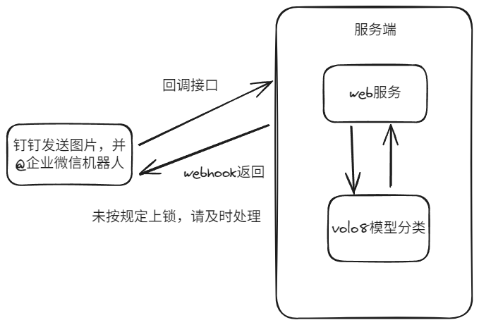

##  基于 YOLO8的带锁不带锁检测

### 项目目标
实现一个能够检测图片中锁是否已经正常被锁住的检测接口；原理：训练volo8的分类模型，
并将分类模型导出为best；fastapi提供对外结构，并实现check_lock接口，传入一张图片，进行预测；
返回钉钉的webhook，告诉图片中是否是锁定状态；

### 项目流程图


### 图片训练

```python
from ultralytics import YOLO

# Load a model
model = YOLO("./model/yolov8n.pt")  # load a pretrained model (recommended for training)

# Train the model
results = model.train(data="path/to/dataset", epochs=100, imgsz=640)
```